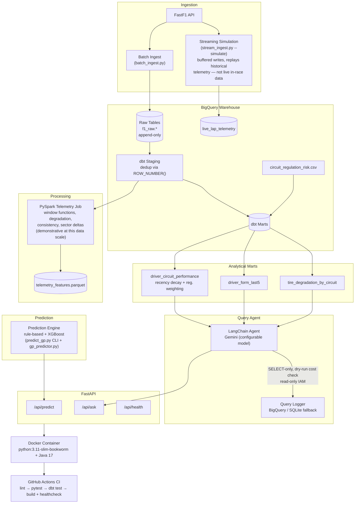

# F1 Race Intelligence Platform

A data engineering + agentic AI platform built on top of an existing F1 race
prediction engine. Combines historical F1 data ingestion, a BigQuery/dbt
warehouse, decay-weighted analytics, and a LangChain + Gemini natural-language
query agent — all containerized and CI-tested.

**Current data coverage:** Hungarian, Italian (Monza), Belgian, and British
Grand Prix, 2018–2024. More circuits can be added via backfill (see below).

---

## Architecture

Every component below has been individually run and its output independently
verified against real F1 results (not just "ran without error") — see
Troubleshooting Appendix for the specific bugs found and fixed in each.



**Note:** `telemetry_features.parquet` (the Spark job's output) is currently a
standalone artifact — it is not yet wired into the prediction engine or the
query agent. Treat it as a proven, working data processing capability, not
(yet) an integrated feature source.

---

## Prerequisites

- Python 3.11+
- A Google Cloud project with the **BigQuery API** enabled
- A Gemini API key (free tier works — see model notes below)
- Docker (optional, for containerized runs)

**On GCP billing:** this project runs on GCP's free/sandbox tier for most
operations (batch loads, dbt staging/marts). A few operations are blocked
without a billing account attached (BigQuery streaming inserts and DML,
higher Gemini rate limits) — the code has fallbacks for these (SQLite
logging fallback, staging-layer deduplication instead of delete-on-write),
so the **core pipeline works without billing enabled**. Enabling billing
removes these restrictions if you hit them.

---

## Setup

### 1. Clone and install
```bash
git clone https://github.com/Aaryaman-Kattali/F1-Race-Intelligence-Platform.git
cd F1-Race-Intelligence-Platform
python -m venv venv
source venv/bin/activate        # Windows: venv\Scripts\activate
pip install -r requirements.txt
```

### 2. Google Cloud setup
1. Create a GCP project (or use an existing one) and enable the **BigQuery API**.
2. Create **two** service accounts:
   - A **writer** account (`BigQuery Data Editor` + `BigQuery Job User`) for ingestion and dbt.
   - A **read-only agent** account (`BigQuery Data Viewer` + `BigQuery Job User` only) for the LangChain query agent — never grant this one write access.
3. Download both as JSON keys and place them **outside version control** (e.g. a local `credentials/` folder — already gitignored).

### 3. Gemini API key
Get a free key from [Google AI Studio](https://aistudio.google.com/apikey).

### 4. Environment file
```bash
cp .env.example .env
```
Fill in `.env` with your real values: `GCP_PROJECT_ID`, both credential file paths, `GOOGLE_API_KEY`, and `GEMINI_MODEL` (defaults to a free-tier-friendly model — see note below). `PERPLEXITY_API_KEY` and `OPENWEATHER_API_KEY` are optional; the pipeline degrades gracefully without them.

**On the Gemini model:** API quota is tracked per model name, not per project. If you hit `429 RESOURCE_EXHAUSTED` on one model, switching `GEMINI_MODEL` in `.env` to a different model (e.g. a Flash-Lite variant) gives you a fresh, untouched quota immediately — no billing required. Check [ai.google.dev/gemini-api/docs/models](https://ai.google.dev/gemini-api/docs/models) for current model names, since these change over time.

---

## Running the project

### Stage 0 — Sanity check (no credentials needed)
```bash
pytest tests/ -v
```
Should show all tests passing (48 at time of writing).

### Stage 1 — API in offline mode
```bash
uvicorn api.app:app --reload --port 8000
```
Check `curl http://localhost:8000/api/health` and `/api/predict` — these work without GCP credentials, using the original rule-based/XGBoost predictor.

### Stage 2 — Ingest data
```bash
# Single season for one circuit:
python -m src.ingestion.batch_ingest --year 2024 --circuits "Hungarian Grand Prix"

# Full available history for one circuit (recommended for meaningful analytics):
python -m src.ingestion.batch_ingest --circuits "Hungarian Grand Prix" --backfill
```
Use the **full official circuit name** (e.g. `"Hungarian Grand Prix"`, not `"hungarian"`) — this must match the naming used in `dbt/seeds/circuit_regulation_risk.csv` or the regulation-risk weighting will silently fall back to a default value.

### Stage 3 — Build the warehouse
```bash
cd dbt
dbt seed   # loads circuit_regulation_risk.csv
dbt run    # builds staging views and mart tables
dbt test   # runs data quality tests
```

### Stage 4 — Query the agent
```bash
curl -X POST http://localhost:8000/api/ask \
  -H "Content-Type: application/json" \
  -d '{"question": "How has Lewis Hamilton performed at the British Grand Prix?"}'
```
The agent only has visibility into the 4 marts/staging tables listed above, is restricted to read-only BigQuery credentials, validates all generated SQL as SELECT-only, and runs a dry-run cost check before executing. It will clearly say so if asked about a circuit with no ingested data.

### Stage 5 — Docker
```bash
docker build -t f1-platform .
docker run -p 8000:8000 --env-file .env -v "${PWD}/credentials:/app/credentials" f1-platform
```

---

## Testing

```bash
pytest tests/ -v --cov=src
```
Covers: feature engineering, predictor scoring logic, the SQL safety validator (direct unit test, independent of LLM behavior), and an agent integration test.

## CI/CD

GitHub Actions (`.github/workflows/ci.yml`) runs on every push: lint (black/flake8) → pytest → dbt run/test (gated — skips gracefully if GCP secrets aren't configured in the repo) → Docker build + healthcheck. Required repo secrets (Settings → Secrets and variables → Actions): `GOOGLE_API_KEY`, `GEMINI_MODEL`, `GCP_PROJECT_ID`, `GOOGLE_APPLICATION_CREDENTIALS_JSON`, `GOOGLE_AGENT_CREDENTIALS_JSON`.

---

## Known limitations (documented honestly, not hidden)

- **Tire degradation** (`tire_degradation_by_circuit`) is a naive linear regression of lap time vs. tyre life within a stint. It does not correct for fuel load, so durable compounds (HARD/MEDIUM) can show apparent negative degradation, since fuel burn-off's speed gain outweighs their small wear effect — only SOFT reliably shows positive (real) degradation. Low-lap-count samples (e.g. 2–3 laps) produce noisy, unreliable slopes; treat these with caution.
- **`regulation_similarity_weight`** in `circuit_regulation_risk.csv` is currently a flat placeholder (1.0) across all circuits. The weighting mechanism is implemented and working; the actual per-circuit values need real curation.
- **dbt requires BigQuery** — there is no working offline/SQLite fallback for the dbt transformation layer specifically (raw ingestion does have a SQLite fallback).
- **Streaming ingestion** (`stream_ingest.py --simulate`) replays historical FastF1 telemetry at configurable intervals — it is not true live in-race data (FastF1 doesn't provide that). Writes are buffered (batched every ~50 laps / 2s) rather than one BigQuery load job per lap, which was necessary to avoid load-job latency starving the consumer.
- **PySpark processing** genuinely runs (via Docker, requires the `bigquery.readSessionUser` IAM role on top of standard read/write roles — the Storage Read API used for parallel reads needs this separately). At this project's data volume (tens of thousands of laps), Spark's parallelism isn't strictly necessary — this demonstrates real distributed-processing patterns (window functions, aggregations) that would scale to multi-season archives, not a claim that this dataset requires Spark.
- **`telemetry_features.parquet` is not yet integrated** into the prediction engine or query agent — it's a verified, standalone output.
- **Query agent quota**: free-tier Gemini models have daily/per-minute request limits, tracked per model name. The agent is optimized to use 1–2 LLM calls per question (static schema, no dynamic introspection), but heavy testing can still exhaust a free-tier model's quota — switch `GEMINI_MODEL` to a different model if this happens (separate quota bucket, no billing needed).
- **Local Windows PySpark runs fail** with a Hadoop/`winutils.exe` error — run Spark jobs via Docker instead (see Troubleshooting Appendix).

---

## Troubleshooting Appendix: PySpark Telemetry Job

This documents real issues hit and fixed while getting the Spark job running —
useful if you hit the same errors setting this up fresh.

### 1. Windows vs. Linux (the move to Docker)
Native Windows PySpark throws `FileNotFoundException` for missing Hadoop binaries (`winutils.exe`) — historically fragile to fix directly. Solution: run Spark jobs inside Docker (Linux), sidestepping the issue entirely. Requires WSL + Virtual Machine Platform enabled for Docker Desktop on Windows.

### 2. Debian base image vs. Java 17
`python:3.11-slim` pulls Debian's rolling "latest" (Trixie), which dropped Java 17 packages in favor of Java 21 — but PySpark requires 8/11/17. Fix: pin the Dockerfile to `python:3.11-slim-bookworm`, which still ships Java 17.

### 3. XGBoost pulling in unnecessary CUDA packages
Default `xgboost>=2.0.0` on Linux pulls ~2.5GB of NVIDIA CUDA libraries (`nvidia-nccl-cu12`) for multi-GPU training this project never uses, bloating the image and exhausting local Docker disk space. Fix: use `xgboost-cpu` in `requirements.txt` instead.

### 4. BigQuery connector version mismatches
- `[DATA_SOURCE_NOT_FOUND]: bigquery` — running via `python` instead of `spark-submit` requires manually injecting the connector via `PYSPARK_SUBMIT_ARGS` env var.
- `NoClassDefFoundError: scala/Serializable` — connector's `_2.12` build didn't match the bundled PySpark's Scala 2.13; switched to `spark-bigquery-with-dependencies_2.13`.
- `NoClassDefFoundError: javax.inject.Provider` — known packaging bug in connector `0.34.0`; fixed by bumping to `0.44.2`.

### 5. GCP IAM for Spark parallel reads
`PERMISSION_DENIED: bigquery.readsessions.create` — the Spark-BigQuery connector uses the BigQuery **Storage Read API** for parallel reads across executors, which needs the `roles/bigquery.readSessionUser` IAM role specifically — not covered by standard Data Editor/Viewer roles. Add it to whichever service account the job authenticates as.

### 6. Schema column name mismatches
The job initially assumed FastF1's raw column names (`round`, `year`); the actual BigQuery staging schema uses `round_number`, `season_year`. Fixed by matching the job's column references to the real warehouse schema.

### Working execution command
```bash
docker build -t f1-platform .
docker run --rm -it \
  -v "${PWD}/credentials:/app/credentials" \
  --env-file .env \
  -e PYSPARK_SUBMIT_ARGS="--packages com.google.cloud.spark:spark-bigquery-with-dependencies_2.13:0.44.2 pyspark-shell" \
  f1-platform \
  python src/processing/telemetry_spark_job.py --source bigquery --bq-table f1_raw_staging.stg_lap_times
```

---

## Project structure

```
├── api/                  FastAPI app (predict + ask endpoints)
├── config/                settings, dynamic standings loader
├── dbt/
│   ├── models/staging/     deduplication layer
│   ├── models/marts/       driver_circuit_performance, driver_form_last5, tire_degradation_by_circuit
│   └── seeds/               circuit_regulation_risk.csv
├── src/
│   ├── agent/               LangChain query agent + query logger
│   ├── data_collectors/     FastF1Collector and others
│   ├── ingestion/            batch_ingest.py
│   ├── mlops/                 model registry
│   ├── predictor/            rule-based/XGBoost prediction engine
│   ├── processors/           feature engineering, rookie cold-start handling
│   └── warehouse/            BigQueryLoader (append-only, sanitized loads)
├── scripts/                one-time diagnostic/migration scripts (documented, kept for reference)
├── tests/
└── .github/workflows/       CI pipeline
```
