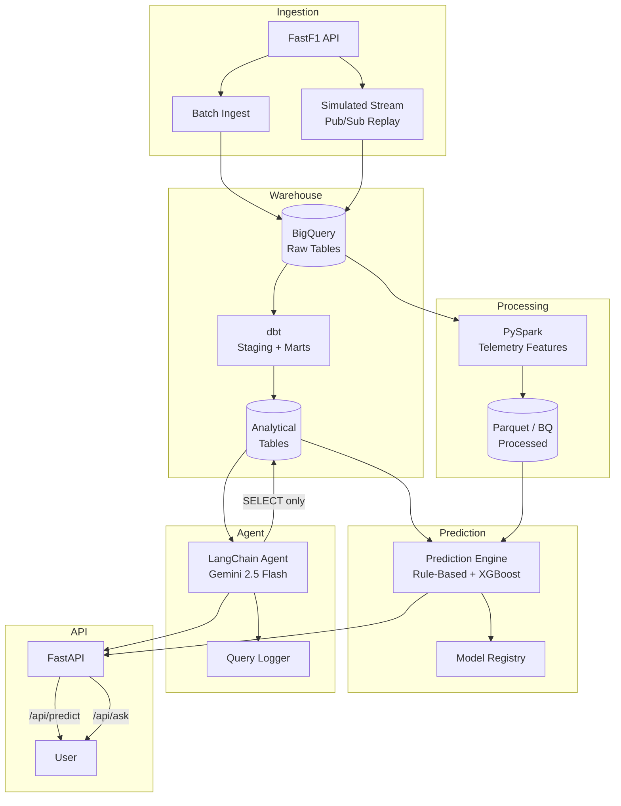

# F1 Race Intelligence Platform

A data engineering + agentic AI platform for Formula 1 race prediction and analysis. Built around a hybrid rule-based/XGBoost prediction engine, extended with a BigQuery data warehouse, dbt transformations, simulated streaming ingestion, PySpark feature engineering, and a LangChain natural-language query agent.

## Architecture



## Components

| Component | Technology | Description |
|-----------|-----------|-------------|
| **API** | FastAPI + Uvicorn | REST API with prediction, circuit listing, health, and natural-language query endpoints |
| **Prediction Engine** | Rule-based + XGBoost | Hybrid scoring: championship form (40%), historical (20%), qualifying (25%), circuit (10%), team (5%), with rookie penalty |
| **Data Warehouse** | Google BigQuery | Raw data lake with race results, qualifying, lap times, weather, standings |
| **Transformations** | dbt (BigQuery) | Staging views + analytical mart tables (driver form, tire degradation, circuit performance). **Requires BigQuery — no offline fallback** |
| **Batch Ingestion** | FastF1 → BigQuery | Scheduled historical data pull via FastF1 API, runnable as cron/GitHub Action |
| **Streaming Ingestion** | Pub/Sub (simulated) | **Simulated streaming**: replays historical telemetry at configurable intervals via Pub/Sub to exercise publish → consume → incremental-load pipeline. Not true live in-race data |
| **Processing** | PySpark | Telemetry feature engineering using window functions, aggregations, and UDFs. **Demonstrates distributed processing patterns** — dataset volume doesn't require Spark's parallelism, but the same job scales to multi-season archives |
| **Query Agent** | LangChain + Gemini 2.5 Flash | Text-to-SQL agent with safety guardrails: read-only service account, SELECT-only enforcement, dry-run cost check before execution |
| **Model Registry** | Filesystem-based | Versioned model storage with metadata (git hash, accuracy, training info) |
| **CI/CD** | GitHub Actions | Lint → test → dbt test (gated on secrets) → Docker build + health check |
| **Observability** | Query Logger | Every agent interaction logged to BigQuery/SQLite with question, SQL, latency, cost estimate |

## Quick Start

### Prerequisites

- Python 3.11+
- Google Cloud project with BigQuery API enabled (for warehouse/dbt/agent)
- Google API key for Gemini (for the query agent)

### 1. Clone and Install

```bash
git clone https://github.com/Aaryaman-Kattali/F1-Race-Predictor.git
cd F1-Race-Predictor
python -m venv .venv
source .venv/bin/activate  # or .venv\Scripts\activate on Windows
pip install -r requirements.txt
```

### 2. Configure Environment

```bash
cp .env.example .env
# Edit .env with your keys:
```

```env
# Required for prediction (existing)
PERPLEXITY_API_KEY=your_perplexity_key
OPENWEATHER_API_KEY=your_openweather_key

# Required for BigQuery / dbt / agent
GCP_PROJECT_ID=your-gcp-project
GOOGLE_APPLICATION_CREDENTIALS=/path/to/service-account.json
GOOGLE_AGENT_CREDENTIALS=/path/to/readonly-service-account.json

# Required for query agent
GOOGLE_API_KEY=your_gemini_api_key

# Optional
OFFLINE_MODE=false
AGENT_MAX_BYTES=104857600  # 100MB dry-run cost limit
```

### 3. Run the API

```bash
uvicorn api.app:app --reload
# API: http://localhost:8000
# Docs: http://localhost:8000/docs
```

### 4. Run with Docker

```bash
docker compose up
# With Pub/Sub emulator for streaming tests:
docker compose --profile streaming up
```

## Usage

### Predict a Race

```bash
# CLI
python scripts/predict_gp.py "Hungarian Grand Prix"

# API
curl -X POST http://localhost:8000/api/predict \
  -H "Content-Type: application/json" \
  -d '{"gp_name": "Hungarian Grand Prix"}'
```

### Ask a Question (Agent)

```bash
curl -X POST http://localhost:8000/api/ask \
  -H "Content-Type: application/json" \
  -d '{"question": "Which driver had the best tire degradation at Monza in 2024?"}'
```

### Batch Ingestion

```bash
python -m src.ingestion.batch_ingest --year 2024 --circuits all
```

### Simulated Streaming

```bash
python -m src.ingestion.stream_ingest --simulate \
  --circuit "Hungarian Grand Prix" --year 2024 --interval 0.5
```

### PySpark Feature Engineering

```bash
spark-submit src/processing/telemetry_spark_job.py \
  --year 2024 --source fastf1
```

### dbt (Requires BigQuery)

```bash
cd dbt
dbt run --profiles-dir .
dbt test --profiles-dir .
```

## Testing

```bash
# Unit tests
pytest tests/ -v --tb=short --cov=src

# Lint
black --check --line-length 120 .
flake8 . --config setup.cfg
```

## Project Structure

```
F1-Race-Predictor/
├── api/                        # FastAPI application
│   └── app.py
├── config/                     # Configuration + dynamic standings
│   ├── settings.py
│   └── circuits.json
├── src/
│   ├── agent/                  # LangChain text-to-SQL agent
│   │   ├── query_agent.py      #   Gemini + safety guardrails
│   │   └── query_logger.py     #   LLMOps observability
│   ├── data_collectors/        # Data ingestion (FastF1, Perplexity, weather)
│   ├── ingestion/              # Batch + simulated streaming paths
│   │   ├── batch_ingest.py
│   │   ├── stream_ingest.py    #   Historical replay, not live data
│   │   └── pubsub_config.py
│   ├── mlops/                  # Model registry + versioning
│   │   └── model_registry.py
│   ├── predictor/              # Prediction engine
│   │   ├── gp_predictor.py     #   Hybrid rule-based + XGBoost
│   │   └── circuit_analyzer.py
│   ├── processing/             # PySpark feature engineering
│   │   └── telemetry_spark_job.py
│   ├── processors/             # Feature engineering (pandas)
│   │   ├── feature_engineer.py
│   │   ├── historical_processor.py
│   │   └── current_processor.py
│   ├── utils/                  # Helpers, circuit mapping
│   └── warehouse/              # BigQuery loader + schemas
│       ├── bigquery_loader.py  #   SQLite fallback for dev only
│       └── schema.py
├── dbt/                        # dbt project (BigQuery only)
│   ├── models/staging/         #   stg_race_results, stg_qualifying, stg_lap_times
│   └── models/marts/           #   driver_form_last5, tire_degradation, circuit_performance
├── tests/                      # pytest suite
├── scripts/                    # CLI prediction scripts
├── .github/workflows/          # CI + scheduled ingestion
├── Dockerfile
├── docker-compose.yml
└── requirements.txt
```

## Agent Safety Design

The natural-language query agent implements three safety guardrails:

1. **Read-only service account** (`GOOGLE_AGENT_CREDENTIALS`): The agent connects to BigQuery with a service account that has only `bigquery.dataViewer` permissions — it cannot modify or delete data.

2. **SELECT-only enforcement**: Before execution, generated SQL is validated to ensure it starts with `SELECT` or `WITH` and contains no DML/DDL keywords (`INSERT`, `UPDATE`, `DELETE`, `DROP`, etc.).

3. **Dry-run cost check**: A BigQuery dry-run estimates bytes to be scanned. Queries exceeding the configurable threshold (default 100MB, set via `AGENT_MAX_BYTES`) are rejected to prevent accidental full-table scans.

## Honest Notes

- **Streaming is simulated**: The streaming path replays historical FastF1 telemetry at configurable intervals via Pub/Sub. FastF1 doesn't provide true live in-race telemetry. This is a legitimate architecture demonstration, not a claim of real-time capability.

- **Spark at this scale is demonstrative**: F1 lap-by-lap telemetry for a season is ~thousands of rows — not a Spark-scale dataset. The PySpark job demonstrates genuine distributed processing patterns (window functions, aggregations) that would scale to multi-season archives. It's honest portfolio engineering, not a claim that this specific dataset requires Spark.

- **dbt requires BigQuery**: The dbt transformation layer targets BigQuery only. There is no offline/SQLite dbt fallback. Only the raw ingestion layer (`BigQueryLoader`) has a SQLite fallback for local development convenience.

## License

MIT
